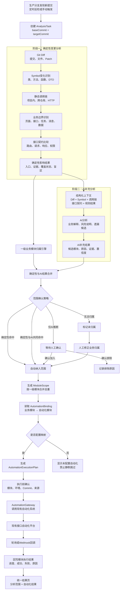
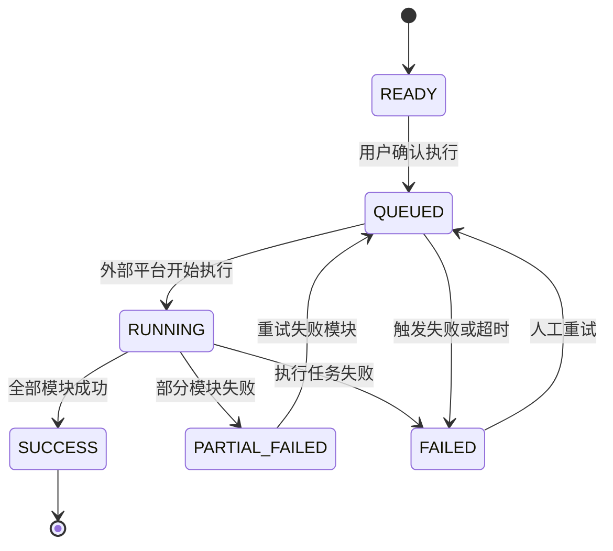

# 变更分析、AI分析与自动化执行详细设计

> 前置的服务全量认知、知识图谱和增量更新方案见[服务知识大纲（Service Atlas）详细设计](./service-knowledge-atlas-design.md)。

## 1. 文档目标

本文档定义 Impact Flow 从生产分支代码变化到调用现有接口自动化系统的完整链路：

```text
变更分析 → AI补充分析 → 圈定一级业务模块 → 映射现有自动化模块 → 执行并回写结果
```

系统不生成新的接口自动化用例，不按影响小标题选择用例。自动化执行的最小单位是一级业务模块；影响小标题仅用于解释为什么需要执行该模块。

## 2. 设计原则

1. 确定性证据优先：Git Diff、Symbol、调用链、接口和页面关系是范围判断的主要依据。
2. AI只做补充：AI可以补充业务语义和静态分析盲区，不能覆盖已确认的确定性证据。
3. 一级模块执行：自动化平台只接收一级业务模块，不做二级场景或用例级映射。
4. 不静默遗漏：未归属模块、未配置自动化映射和分析盲区必须显式展示。
5. 全程可追溯：分析结果、人工确认、自动化任务和目标Commit必须关联。
6. 幂等执行：同一分析任务下，同一业务模块最多生成一个有效执行项。

## 3. 总体架构



## 4. 一级业务模块目录

| 模块编码 | 展示名称 | 主要页面或识别规则 |
| --- | --- | --- |
| `SITE_LIST` | 工地列表 | `#/project/list` |
| `SITE_CHECKIN` | 工地签到 | `/device/history/sign` |
| `SITE_INSPECTION` | 工地巡检 | `#/screen-monitor` |
| `SITE_PROBLEM` | 工地问题 | `/#/report/screen-monitor-report` |
| `ACCEPTANCE_REPORT` | 验收报告 | `/acceptance-report` |
| `EVENT_REPORT` | 事件报备 | `#/project/event-report` |
| `CAMERA` | 摄像头 | 除明确签到入口外的 `device` 相关页面、接口和调用链 |
| `AI_FEATURE` | AI相关 | AI、人脸、算法、识别相关页面、接口和调用链 |

业务模块归属顺序：已确认页面路由、页面到请求的调用关系、HTTP路由、人工业务映射、代码语义推断、AI候选归属。

`/device/history/sign`虽然包含`device`，必须优先归入`SITE_CHECKIN`；其他`device`相关入口才归入`CAMERA`。一个影响链可以同时命中多个一级模块，但每个模块只执行一次。

## 5. 核心处理流程

### 5.1 变更分析

输入包括项目、基础Commit、目标Commit、提交记录、文件列表、Patch和关联仓库配置。

处理步骤：

1. 计算两个Commit之间的Git Diff。
2. 将变更行映射到Symbol。
3. 从变更Symbol反向追踪调用者。
4. 识别HTTP服务端路由、前端请求、页面、任务、消息和数据边界。
5. 将入口映射到一级业务模块。
6. 记录未映射文件、扫描限制和跨仓库读取失败。

输出示例：

```json
{
  "businessModuleId": "SITE_CHECKIN",
  "businessModuleName": "工地签到",
  "reasons": ["工地签到查询", "签到摄像头检测"],
  "source": "RULE",
  "confidence": "HIGH",
  "sourceSymbolKeys": ["SignService.query"],
  "entryPoints": ["POST /device/history/sign"],
  "evidence": ["SignService.query → SignController.history"]
}
```

### 5.2 AI补充分析

AI输入必须为结构化数据，包含Diff、Patch、Symbol变化、调用链、HTTP路由、确定性分析结果和业务模块目录。

AI负责：

- 将技术证据转换为业务语言。
- 解释为什么某一级模块可能受到影响。
- 发现确定性分析未覆盖的候选模块。
- 标记证据不足和需要人工确认的范围。

AI不得编造入口、覆盖确定性结果、直接触发自动化，或把“由AI生成”误判为属于`AI_FEATURE`模块。

### 5.3 范围合并

合并键为`analysisId + businessModuleId`。同一模块的多条影响合并为一条`ModuleScope`：

```json
{
  "analysisId": "analysis-123",
  "businessModuleId": "SITE_CHECKIN",
  "businessModuleName": "工地签到",
  "reasons": ["工地签到查询", "人脸签到触发"],
  "source": "BOTH",
  "confidence": "HIGH",
  "selectionStatus": "SELECTED"
}
```

`reasons`只用于解释范围，不参与自动化模块匹配。

### 5.4 范围确认策略

| 命中情况 | 默认处理 |
| --- | --- |
| 确定性分析命中 | 自动选中 |
| 确定性分析和AI同时命中 | 自动选中，并标记`BOTH` |
| 只有AI命中且存在证据引用 | 等待人工确认 |
| 只有AI命中且无有效证据 | 不选中，标记低置信度 |
| 无法归属一级模块 | 阻止自动执行并提示修正 |

## 6. 自动化模块映射

系统只维护一级模块映射：

```json
{
  "workspaceId": "workspace-1",
  "businessModuleId": "SITE_CHECKIN",
  "automationModuleId": "site-checkin",
  "automationModuleName": "工地签到接口自动化",
  "enabled": true
}
```

不建立“签到查询”“摄像头绑定”等小标题到自动化用例的二级映射。

执行计划生成规则：

1. 读取所有已选中的`ModuleScope`。
2. 按`businessModuleId`去重。
3. 查询工作空间下启用的自动化模块映射。
4. 有映射的生成执行项。
5. 无映射的生成阻塞项并展示配置缺失。
6. 保存计划快照，后续配置变化不影响已创建的计划。

## 7. 调用现有自动化系统

触发请求示例：

```json
{
  "analysisId": "analysis-123",
  "environment": "test",
  "modules": ["site-checkin", "camera"],
  "metadata": {
    "projectId": "project-1",
    "baseCommit": "c13a2080",
    "targetCommit": "b1d7fe84",
    "triggerSource": "IMPACT_FLOW"
  }
}
```

现有自动化平台返回：

```json
{
  "executionId": "execution-20260922-001",
  "status": "QUEUED"
}
```

优先使用自动化平台Webhook；平台不支持Webhook时使用轮询。



状态回写包含外部执行ID、模块进度、通过/失败/跳过数量、失败原因、报告地址和执行时间。

## 8. 核心数据模型

### 8.1 `business_module_catalog`

| 字段 | 说明 |
| --- | --- |
| `module_code` | 固定模块编码 |
| `module_name` | 中文名称 |
| `route_rules` | 页面路由和接口匹配规则 |
| `enabled` | 是否启用 |

### 8.2 `analysis_module_scope`

| 字段 | 说明 |
| --- | --- |
| `analysis_id` | 分析任务ID |
| `business_module_id` | 一级模块ID |
| `reasons` | 影响小标题快照 |
| `source` | `RULE`、`AI`或`BOTH` |
| `confidence` | 置信度 |
| `selection_status` | `SELECTED`、`PENDING_CONFIRMATION`或`EXCLUDED` |
| `evidence` | 证据快照 |

唯一键：`analysis_id + business_module_id`。

### 8.3 `automation_module_binding`

| 字段 | 说明 |
| --- | --- |
| `workspace_id` | 工作空间 |
| `business_module_id` | 一级业务模块 |
| `automation_module_id` | 现有自动化平台模块ID |
| `automation_module_name` | 自动化模块名称 |
| `enabled` | 是否启用 |
| `updated_by` | 最后修改人 |

唯一键：`workspace_id + business_module_id`。

### 8.4 `automation_execution`

| 字段 | 说明 |
| --- | --- |
| `id` | 本地执行任务ID |
| `analysis_id` | 来源分析任务 |
| `environment` | 执行环境 |
| `status` | 总体状态 |
| `external_execution_id` | 外部自动化任务ID |
| `request_snapshot` | 触发请求快照 |
| `error_message` | 触发或同步失败原因 |
| `started_at`、`finished_at` | 执行时间 |

### 8.5 `automation_module_result`

| 字段 | 说明 |
| --- | --- |
| `execution_id` | 本地执行任务ID |
| `business_module_id` | 一级模块 |
| `automation_module_id` | 外部自动化模块 |
| `status` | 模块执行状态 |
| `passed_count` | 通过数量 |
| `failed_count` | 失败数量 |
| `skipped_count` | 跳过数量 |
| `report_url` | 外部报告地址 |
| `failure_summary` | 失败摘要 |

## 9. 服务边界

| 服务 | 职责 |
| --- | --- |
| `ChangeAnalysisService` | 编排Git、Symbol、调用链和确定性范围分析 |
| `BusinessModuleResolver` | 根据路由、接口和证据归属一级模块 |
| `AiImpactAnalyzer` | 生成AI补充范围和风险解释 |
| `ImpactScopeMerger` | 合并规则与AI结果并生成模块范围 |
| `AutomationBindingService` | 维护一级业务模块到自动化模块的映射 |
| `AutomationPlanService` | 生成、校验和确认执行计划 |
| `AutomationGateway` | 适配现有自动化平台API |
| `AutomationExecutionWorker` | 触发任务、轮询状态、处理重试 |
| `AutomationCallbackService` | 校验Webhook并回写结果 |

## 10. 建议API

| Method | Path | 说明 |
| --- | --- | --- |
| `GET` | `/api/business-modules` | 查询一级业务模块目录 |
| `GET` | `/api/automation-bindings` | 查询自动化模块映射 |
| `PUT` | `/api/automation-bindings/:moduleId` | 更新单个一级模块映射 |
| `GET` | `/api/analyses/:id/module-scopes` | 查询圈定的一级模块范围 |
| `POST` | `/api/analyses/:id/module-scopes/confirm` | 确认AI候选模块 |
| `POST` | `/api/analyses/:id/automation-plan` | 创建执行计划 |
| `POST` | `/api/automation-executions/:id/start` | 调用现有自动化平台 |
| `GET` | `/api/automation-executions/:id` | 查询执行进度和结果 |
| `POST` | `/api/automation-callbacks/:provider` | 接收自动化平台回调 |

## 11. 页面设计

分析结果页分为四个连续区域：变更分析、AI补充、一级模块范围、自动化执行。

```text
工地签到                                           P0
来源：变更分析 + AI分析    自动化：已配置

影响原因
- 工地签到查询
- 人脸签到触发
- 签到摄像头检测

自动化模块：工地签到接口自动化
执行状态：待执行
```

执行按钮上方汇总本次影响模块数、已配置映射数、未配置映射数、待确认AI候选数、执行环境和目标Commit。

## 12. 异常、重试与幂等

- 分析任务和自动化任务使用独立状态机，自动化失败不修改分析结论。
- 触发外部自动化时携带幂等键：`analysisId + planVersion`。
- 网络超时后先查询外部任务，确认未创建后才能重试触发。
- 轮询连续失败时展示最后成功同步时间和失败原因。
- 模块执行失败可以只重试失败模块，但执行单位仍然是一级模块。
- 外部回调必须校验签名、时间戳和执行ID。
- 历史执行使用创建时的绑定快照，不能被后续配置修改污染。

## 13. 实施阶段

### 阶段一：业务范围标准化

- 将八个一级业务模块和页面路由放入后端统一目录。
- 后端输出稳定的`businessModuleId`。
- 合并规则分析和AI分析，生成模块级范围。
- 增加人工确认和未归属提示。

### 阶段二：自动化平台映射

- 建立`automation_module_binding`。
- 提供映射配置页面和API。
- 生成模块级执行计划。
- 展示已配置、未配置和待确认状态。

### 阶段三：自动化执行闭环

- 实现`AutomationGateway`并对接现有自动化平台启动接口。
- 接入轮询或Webhook。
- 展示模块级进度、结果和失败原因。
- 支持失败模块重试。

## 14. 验收标准

1. 任一分析结果只能输出约定的八个一级业务模块。
2. `/device/history/sign`不会被误归入摄像头模块。
3. 同一模块命中多条影响时，执行计划中只出现一次。
4. 影响小标题不会参与自动化模块匹配。
5. 仅AI命中的模块不会在未确认时自动执行。
6. 未配置自动化映射的模块会明确提示，且不会静默跳过。
7. 自动化任务能够关联分析ID、目标Commit和外部执行ID。
8. 页面能够展示每个一级模块的执行状态、数量和失败原因。
9. 重试不会重复创建相同外部任务。
10. 历史分析和自动化执行结果可以完整追溯。
