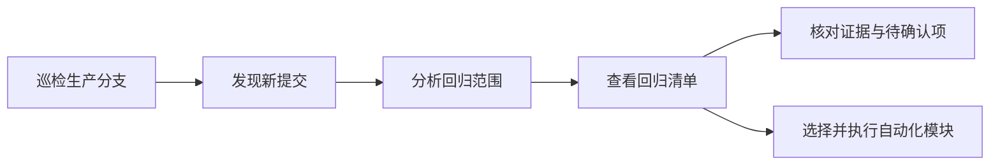

# Impact Flow 回归智能分析最终设计

## 1. 产品目标

Impact Flow 只回答一个问题：

> 一次代码变更完成后，需要回归哪些业务场景，为什么？

系统输入是一段确定的 Git 版本区间，输出是一份按优先级排序、可执行、带证据且明确暴露未知项的回归计划。代码图、Symbol、规则和大模型都是内部分析手段，不作为独立产品结果。

## 2. 核心原则

1. **回归计划是唯一结果**：页面不再分别展示规则结果和 AI 结果。
2. **事实与解释分离**：Git、AST、类型系统和调用链负责事实；AI 负责业务化解释与候选补充。
3. **结论必须有证据**：每个确定回归项必须能够追溯到文件、Symbol、路由或调用链。
4. **未知必须显式展示**：无法追踪到业务入口的变更进入 `unknowns`，不得静默遗漏。
5. **版本必须可复现**：一次分析绑定主仓库和关联仓库的 Commit 快照。
6. **AI 失败不阻断分析**：未配置或调用失败时，系统仍输出静态分析结果。
7. **按需探索**：围绕本次变更追踪依赖，不预先构建和人工维护全量“影响索引”。

## 3. 用户流程



用户只需要：

1. 接入仓库并配置生产分支；
2. 巡检或由定时任务发现新提交；
3. 点击“分析回归范围”；
4. 按 P0/P1/P2 执行回归项。

## 4. 分析流水线

一次分析由同一个持久化 Worker 完成，不再拆分独立 AI 任务。

### 4.1 固定分析上下文

创建 `AnalysisContextSnapshot`：

- 主仓库 `baseCommit` 与 `targetCommit`；
- 工作空间内关联仓库的当前 Commit；
- 分析器版本；
- 快照时间。

分析过程中和历史结果回看都使用该快照，不读取“最新索引”。

### 4.2 获取受控变更证据

- Git commit 摘要；
- 文件增删改统计；
- 过滤和脱敏后的 Diff patch；
- 删除、重命名和配置变化。

#### 4.2.1 变更相关性过滤

`ChangeRelevancePolicy` 在 Git Diff 之后、Symbol 与 AI 分析之前，对每个文件做确定性分类：

| 分类 | 处理方式 | 典型文件 |
| --- | --- | --- |
| `BUSINESS_RELEVANT` | 进入 Symbol、语义、影响与 AI 分析 | 运行时代码、数据库迁移、SQL、运行时提示词 |
| `TECHNICAL_VALIDATION` | 不推断业务影响，生成构建、依赖、测试或交付验证建议 | 测试、锁文件、Docker、CI/CD、构建配置 |
| `IGNORED` | 不进入后续分析 | 普通 Markdown、设计文档、图片、IDE 配置、生成产物 |
| `NEEDS_REVIEW` | 保守进入分析并明确低置信 | 无法识别的扩展名或用途 |

混合提交只把 `BUSINESS_RELEVANT` 与 `NEEDS_REVIEW` 的文件和 Diff 证据交给后续分析。纯文档变更直接返回“无需业务回归”，不调用 Symbol 分析和 AI；纯技术变更只给出技术验证建议。数据库与迁移文件始终视为业务相关，不能因文件类型被忽略。

过滤结果及命中规则写入 `AnalysisContextSnapshot.relevance`，用于结果解释和规则版本追踪；原始变更文件仍完整保留。规则只负责相关性分类，不直接判断最终业务优先级。

### 4.3 Symbol 与依赖探索

TypeScript 分析器分别在 base/target 上建模并比较：

- 类、方法、函数、接口、类型和属性变化；
- 调用者与被调用者；
- Controller、HTTP 路由、页面等业务边界；
- 工作空间内关联仓库调用关系。

探索围绕变更 Symbol 展开，到达业务边界或达到深度预算后停止。

### 4.4 语义变更单元

`ChangeInterpreter` 将事实转换成 `ChangeUnit`：

```ts
interface ChangeUnit {
  id: string;
  symbolKey?: string;
  title: string;
  filePath: string;
  startLine?: number;
  changeType: 'ADDED' | 'MODIFIED' | 'DELETED';
  changeKind:
    | 'BEHAVIOR'
    | 'CONTRACT'
    | 'VALIDATION'
    | 'DATA'
    | 'CONFIG'
    | 'REFACTOR'
    | 'UNKNOWN';
  summary: string;
  riskLevel: RiskLevel;
  evidence: string[];
}
```

### 4.5 场景解析和候选生成

`ChangeImpactAnalyzer` 根据以下顺序定位业务场景：

1. HTTP、页面、任务和消息入口；
2. 调用链上的业务边界；
3. 跨仓调用边界；
4. 文件和模块语义；
5. 无法确定时生成待确认候选。

候选必须带 `sourceSymbolKeys`、`entryPoints` 和 `evidence`。

### 4.6 AI 可选增强

AI 在同一次分析中接收冻结后的结构化上下文：

- ChangeUnit；
- Diff 证据；
- Symbol 变更与调用链；
- 静态候选；
- 仓库版本快照。

`AiAnalysisBatchPlanner` 不再通过 `slice(0, N)` 丢弃尾部变更。AI 配置中的 `maxFiles` 和 `maxSymbols` 表示单批容量；规划器按高风险文件优先、单批 Diff 字符预算和 Symbol 数量拆分全部业务相关变更。每批独立调用模型，候选最终交给统一场景规划器归并。

每个文件都会写入最终 `regressionPlan.aiCoverage` 覆盖账本；冻结输入上下文保持不可变：

- `FULL_EVIDENCE`：发送了完整受控 Diff；
- `PARTIAL_EVIDENCE`：发送了被安全预算截断的 Diff；
- `SUMMARY_ONLY`：没有可发送 Patch，但文件统计和语义摘要已进入批次；
- `FAILED`：所属 AI 批次失败，由静态分析兜底。

单批失败不阻断其他批次；全部批次失败时才整体降级为纯静态分析。覆盖账本同时记录文件、Symbol、调用链和批次完成数量，不能静默遗漏。

AI 可以：

- 将技术名称转换为清晰业务语言；
- 合并重复范围；
- 补充需要人工确认的遗漏候选；
- 给出更明确的验证重点。

AI 不可以：

- 声称看过未提供的代码；
- 创建没有输入证据的确定调用关系；
- 将低置信推断标记为已确认；
- 修改版本上下文。

### 4.7 最终回归计划

`RegressionPlanner` 合并静态候选和 AI 候选，去重并排序：

规划器当前使用 v4 规则：从变更单元归纳“代码变化 → 调用传播 → 业务结果”因果链，按业务动作生成可执行验证点，并重新校准每个范围的 P0/P1/P2。场景归并以业务域和业务场景为身份，以 HTTP、页面、任务、消息或数据边界作为聚合根；关联的 Service、DAO、Entity 等内部调用只补充传播证据，不再单独生成重复卡片。同一场景只有一个可靠业务边界时，未映射到 Symbol 的源码文件也会作为“调用关系待确认”的证据吸收，非源码或存在多个边界歧义时仍保留独立待确认项。P0 只保留给支付、权限、核心状态回写、不可逆数据变化等高置信严重风险；普通查询和常规增删改不会因为总体风险较高而全部升级为 P0。

```ts
interface RegressionPlan {
  version: number;
  summary: string;
  riskLevel: RiskLevel;
  targets: RegressionTarget[];
  unknowns: string[];
  generatedBy: 'STATIC' | 'STATIC_AND_AI';
  model: string | null;
  generatedAt: string;
}
```

每个 `RegressionTarget` 包含：

- P0/P1/P2；
- 业务场景或回归对象；
- 回归原因；
- 入口；
- 验证重点；
- 关联测试；
- 证据；
- 置信度。

## 5. 领域和代码边界

```text
core/
├── ports/
│   ├── git.gateway.ts
│   ├── symbol-analyzer.gateway.ts
│   ├── ai-analyzer.gateway.ts
│   └── analysis.repository.ts
└── services/
    ├── change-interpreter.ts
    ├── change-relevance.policy.ts
    ├── change-impact.analyzer.ts
    ├── ai-analysis-batch.planner.ts
    ├── business-impact.resolver.ts
    ├── regression-scenario.merger.ts
    └── regression-planner.ts
```

- Core 不依赖 NestJS、MySQL 或具体模型供应商；
- Git、TypeScript、AI 和 MySQL 都是可替换 Adapter；
- `AnalysesService` 只负责编排用例和事务边界；
- `analysis_task` 是 `AnalysisRun` 聚合的持久化载体。

## 6. 数据模型

`analysis_task` 新增：

| 字段 | 内容 |
| --- | --- |
| `analysis_context` | 不可变仓库版本快照 |
| `change_units` | 语义变更单元 |
| `regression_plan` | 最终回归清单 |
| `analysis_version` | 分析领域模型版本 |

废弃并删除：

- `service_knowledge_build`；
- 项目上的 Atlas 业务系统字段；
- 分析任务上的独立 AI 排队、租约和结果字段；
- `ai_analysis_log`；
- Service Atlas 构建 API、Worker 和前端入口。

AI 配置仍然保留，它现在是回归分析流水线的可选解释器，而不是第二套任务系统。

## 7. 失败与降级

| 失败点 | 行为 |
| --- | --- |
| Git 同步失败 | 整体任务重试 |
| Symbol 分析失败 | 使用文件级 ChangeUnit，unknowns 显示覆盖不足 |
| AI 未配置 | `generatedBy=STATIC`，正常完成 |
| AI 调用失败 | 记录警告并使用静态计划，正常完成 |
| 部分 AI 批次失败 | 保留成功批次，失败文件标记为 `FAILED`，静态候选继续参与最终规划 |
| 未找到业务边界 | 写入 `unknowns`，不伪造回归范围 |
| Worker 中断 | 依靠任务租约重新领取 |

## 8. 前端信息架构

正式页面路由：

- `/analysis`：回归分析工作台；
- `/services`：仓库接入；
- `/logs`：回归分析与通知日志；
- `/members`：成员管理；
- `/settings`：AI、通知和自动巡检配置；
- `/workspace-settings`：工作空间设置。

分析详情只展示两列：

- 左侧：回归内容；
- 右侧：判定依据。

## 9. 验收标准

1. 用户只执行一次“分析回归范围”，不需要再启动 AI；
2. 每次成功分析都生成 `analysisContext`、`changeUnits` 和 `regressionPlan`；
3. 每个高置信回归项至少包含一个证据；
4. 未覆盖变更必须出现在 `unknowns`；
5. AI 关闭或失败时分析仍成功；
6. 历史结果携带固定版本上下文；
7. 普通文档、生成产物和开发辅助文件不会制造业务回归项；混合提交只分析业务相关文件；
8. UI 不再出现“影响索引”与独立“AI 分析”入口；
9. API、单元测试、类型检查和前端生产构建全部通过。

## 10. 后续演进

优先级从高到低：

1. 增加 Java/Spring 和 Go 适配器；
2. 从测试文件和测试平台反查已有用例；
3. 增加人工确认、排除和遗漏补充反馈；
4. 沉淀团队场景注册表；
5. 用历史缺陷与测试结果校准排序；
6. 对分析准确率、覆盖率和误报率建立评测集。

## 11. 用户反馈与自动化测试推荐

- 用户可以对每个回归目标标记“需要回归”或“本次不回归”，反馈绑定当前分析任务、目标、操作人和时间；重新分析产生新任务，不自动继承旧反馈。
- 系统只针对已确认的 HTTP 业务入口生成“推荐执行的接口自动化测试”，展示建议入口、原因和验证重点。
- 本系统不建设手工用例库，不保存或编排接口自动化用例，也不会因为展示推荐而自动触发测试执行。
- 分析结果明确显示由纯静态分析生成，还是经过 AI 增强及所使用的模型。
