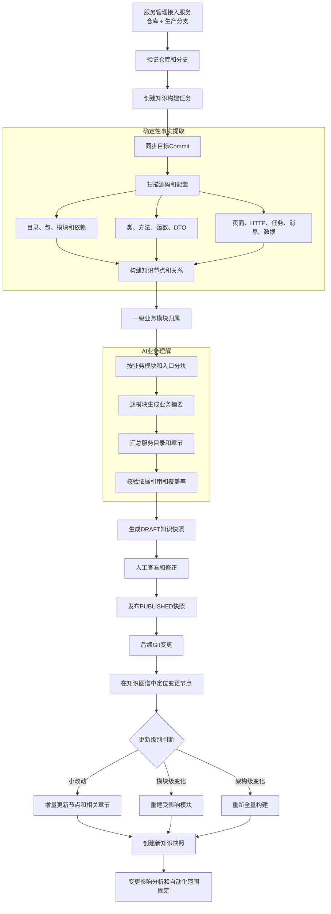
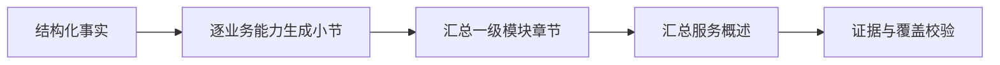
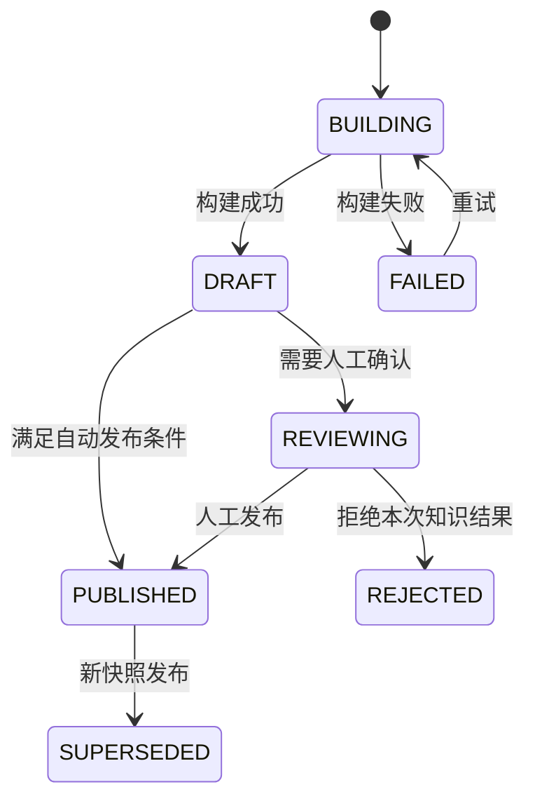
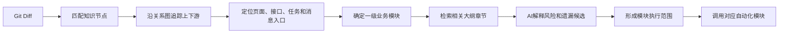

# 服务知识大纲（Service Atlas）详细设计

## 1. 文档目标

本文档定义Impact Flow在服务接入后，如何全量读取服务代码，构建长期保存的服务知识底图，并在后续代码变更中增量更新和复用该知识。

目标是把当前的“每次变更临时理解项目”升级为：

```text
服务首次接入
→ 全量构建服务知识
→ 生成结构化知识图谱和可阅读大纲
→ 人工确认关键业务归属
→ 发布知识快照

后续代码变化
→ 定位既有知识节点
→ 增量更新受影响部分
→ 基于知识底图计算影响范围
→ AI读取相关章节补充解释
→ 圈定一级业务模块
→ 调用现有自动化模块
```

本文档中的能力属于规划设计；当前项目已有的Git仓库缓存、Diff分析、TypeScript/Vue AST、Symbol分析、HTTP调用匹配、AI Provider和后台任务机制可作为实现基础。

## 2. 核心定义

### 2.1 服务知识大纲

服务知识大纲是一份可阅读的分层目录，用于描述一个服务“负责什么、提供什么入口、依赖什么、影响什么业务”。

可以将其理解为一本书：

| 图书概念 | 系统概念 |
| --- | --- |
| 一本书 | 一个接入的服务或仓库 |
| 章 | 一级业务模块 |
| 节 | 页面、接口、任务、消息或业务能力 |
| 段落 | Controller、Service、DTO、数据表和具体Symbol |
| 目录 | 人可阅读的服务大纲 |
| 索引 | 机器可查询的节点、关系和代码证据 |

### 2.2 服务知识图谱

服务知识图谱是大纲背后的结构化事实层。它保存节点、关系、代码位置、Commit和证据，供变更分析精确检索。

### 2.3 知识快照

知识快照表示某个服务在特定Commit上的完整认知版本。已发布快照不可修改；更新会产生新快照，历史分析继续绑定原快照。

### 2.4 稳定节点

稳定节点是可以跨Commit识别的知识对象，例如页面路由、HTTP接口、类、方法、任务和消息主题。节点通过稳定键和内容指纹完成版本间匹配。

## 3. 设计原则

1. **事实与总结分离**：静态解析器生产代码事实，AI生产业务解释，不能只保存一篇AI文章。
2. **证据优先**：每个业务归属和影响结论都应能追溯到文件、Symbol、路由或调用链。
3. **快照不可变**：分析任务必须绑定知识快照，避免后来更新知识导致历史结论改变。
4. **增量优先**：小改动只更新相关节点和章节，不重新阅读整个仓库。
5. **重建可控**：架构级变化触发模块级或服务级重建，不依赖人工猜测。
6. **人工修正优先**：人工确认的业务映射高于AI推断，并在后续版本持续复用。
7. **AI最小上下文**：AI只读取相关知识章节和变更证据，不把整个仓库一次性塞入模型。
8. **不静默遗漏**：无法解析、无法归属、读取失败和扫描截断必须作为知识盲区保存。
9. **工作空间隔离**：知识、人工映射和AI上下文严格限定在当前工作空间。
10. **敏感信息隔离**：密钥、配置密码和隐私数据不得进入知识库或AI上下文。

## 4. 总体架构



## 5. 双层知识模型

### 5.1 第一层：结构化事实层

结构化事实层供系统查询和影响分析使用，包含以下节点：

| 节点类型 | 示例 |
| --- | --- |
| `SERVICE` | `agile-service-prd` |
| `BUSINESS_MODULE` | 工地签到、工地问题、摄像头 |
| `PAGE` | `#/project/list` |
| `API` | `POST /project/event-filing/create` |
| `CONTROLLER` | `ProjectController` |
| `SERVICE_CLASS` | `ProjectService` |
| `SYMBOL` | `ProjectService.create` |
| `DTO` | `CreateProjectDto` |
| `JOB` | 定时巡检任务 |
| `MESSAGE` | 问题消息推送主题 |
| `DATA` | 数据表、集合或缓存键 |
| `EXTERNAL_SERVICE` | 摄像头、AI或其他微服务 |
| `BLIND_SPOT` | 未解析文件、读取失败、动态调用 |

主要关系：

| 关系类型 | 含义 |
| --- | --- |
| `CONTAINS` | 服务或模块包含节点 |
| `BELONGS_TO` | 节点归属于业务模块 |
| `CALLS` | Symbol调用另一个Symbol |
| `REQUESTS` | 页面或前端方法请求HTTP接口 |
| `EXPOSES` | Controller暴露HTTP接口 |
| `IMPLEMENTS` | Symbol实现接口或抽象 |
| `USES_DTO` | 接口或方法使用DTO |
| `READS_DATA` | 读取表、集合或缓存 |
| `WRITES_DATA` | 写入表、集合或缓存 |
| `PUBLISHES` | 发布消息或事件 |
| `CONSUMES` | 消费消息或事件 |
| `TRIGGERS` | 入口触发任务或流程 |
| `DEPENDS_ON` | 服务或模块依赖外部服务 |
| `EVIDENCED_BY` | 结论对应代码证据 |

### 5.2 第二层：可阅读大纲层

可阅读大纲供测试、产品和开发查看。建议固定以下层次：

```text
服务名称
├─ 服务概述
├─ 一级业务模块
│  ├─ 业务能力或影响小标题
│  │  ├─ 页面入口
│  │  ├─ HTTP接口
│  │  ├─ 核心调用链
│  │  ├─ 请求和响应模型
│  │  ├─ 数据与消息依赖
│  │  └─ 外部服务依赖
│  └─ 未确认范围
├─ 跨模块依赖
├─ 跨服务依赖
├─ 后台任务和消息链路
└─ 知识盲区
```

示例：

```text
agile-service-prd

1. 工地列表
   1.1 工地查询
       页面：#/project/list
       接口：
       - POST /project/suggest/search
       - POST /project/node/info/list
       核心代码：ProjectController、ProjectService
       依赖：人员服务、营销服务

   1.2 工地创建
       接口：
       - POST /live/marketing/project/add/list
       - POST /project/event-filing/create

2. 工地签到
   2.1 签到记录查询
       页面：/device/history/sign

   2.2 人脸签到
       AI依赖：人脸识别
       设备依赖：摄像头

3. 工地巡检
4. 工地问题
5. 验收报告
6. 事件报备
7. 摄像头
8. AI相关
```

## 6. 首次全量知识构建

### 6.1 触发时机

- 服务接入成功且仓库连接验证通过。
- 服务修改仓库地址或生产分支。
- 当前服务没有已发布知识快照。
- 用户手动点击“全量重建”。

服务创建本身不应等待知识构建完成。创建成功后异步排队，服务管理页面显示构建状态。

### 6.2 构建步骤

1. 固定目标Commit，后续所有读取使用同一Commit。
2. 获取文件清单，执行包含/排除规则。
3. 识别语言、框架和项目结构。
4. 提取Symbol、import、继承、实现和调用关系。
5. 提取页面路由、HTTP客户端请求和服务端路由。
6. 提取DTO、Schema、任务、消息和数据访问。
7. 合并同仓库关系。
8. 根据相关服务配置匹配跨仓库HTTP调用。
9. 根据固定规则和人工规则映射一级业务模块。
10. 保存结构化节点、关系和盲区。
11. 按业务模块切分AI输入。
12. AI生成各章节，再生成服务概述。
13. 校验AI引用的节点是否真实存在。
14. 计算覆盖率和置信度。
15. 保存草稿快照，等待自动或人工发布。

### 6.3 扫描范围

默认扫描：

- 业务源码和页面源码。
- 路由、Controller、Service、DTO和数据访问代码。
- OpenAPI、GraphQL、消息和任务配置。
- 包管理和模块依赖文件。
- 与业务关系有关的配置文件。

默认排除：

- `node_modules`、`vendor`、`dist`、`build`和`coverage`。
- 自动生成代码和压缩文件。
- 二进制文件和超大数据文件。
- `.env`、私钥、证书和密钥文件。
- Git历史对象和临时缓存。

### 6.4 构建阶段

```text
QUEUED
→ SYNCING_REPOSITORY
→ DISCOVERING_STRUCTURE
→ EXTRACTING_SYMBOLS
→ LINKING_RELATIONS
→ CLASSIFYING_BUSINESS
→ GENERATING_OUTLINE
→ VALIDATING_RESULT
→ SAVING_SNAPSHOT
→ COMPLETED
```

每个阶段保存进度、说明、开始时间、更新时间、尝试次数和失败原因。

## 7. 一级业务模块归属

当前固定一级业务模块：

| 编码 | 名称 | 高优先级页面或识别规则 |
| --- | --- | --- |
| `SITE_LIST` | 工地列表 | `#/project/list` |
| `SITE_CHECKIN` | 工地签到 | `/device/history/sign` |
| `SITE_INSPECTION` | 工地巡检 | `#/screen-monitor` |
| `SITE_PROBLEM` | 工地问题 | `/#/report/screen-monitor-report` |
| `ACCEPTANCE_REPORT` | 验收报告 | `/acceptance-report` |
| `EVENT_REPORT` | 事件报备 | `#/project/event-report` |
| `CAMERA` | 摄像头 | 除明确签到入口外的`device`相关能力 |
| `AI_FEATURE` | AI相关 | AI、人脸、算法、识别相关能力 |

归属优先级：

1. 人工确认且锁定的映射。
2. 产品页面路由映射。
3. 页面到前端请求、后端路由的确定性关系。
4. HTTP Method与标准化Path规则。
5. 包、目录、Symbol和DTO命名规则。
6. AI候选归属。
7. 无法确认时进入`UNMAPPED`，不能默认归入工地列表。

`/device/history/sign`必须优先归入`SITE_CHECKIN`；其他`device`入口再归入`CAMERA`。

一个知识节点可以关联多个一级模块，但必须分别记录关联证据和置信度。

## 8. AI生成大纲设计

### 8.1 AI输入

禁止把整个仓库原文一次性提交给AI。输入按模块和入口分块，包含：

- 服务和目标Commit。
- 本模块节点清单。
- 页面和接口入口。
- 精简后的调用链。
- DTO和数据依赖摘要。
- 跨服务依赖。
- 代码位置和证据ID。
- 已确认的业务词汇和人工映射。
- 当前章节的旧版本内容（增量更新时）。

### 8.2 分层生成



先生成最小业务小节，再向上汇总，避免模型在大上下文中遗漏入口。

### 8.3 AI输出约束

每个章节必须输出：

```json
{
  "title": "工地签到查询",
  "summary": "查询工地签到记录及关联设备状态",
  "businessModuleId": "SITE_CHECKIN",
  "entryNodeIds": ["node-api-sign-history"],
  "evidenceNodeIds": ["node-symbol-sign-query"],
  "confidence": "HIGH",
  "uncertainties": []
}
```

AI不得：

- 引用输入中不存在的节点。
- 编造页面、接口、数据表和调用链。
- 把代码注释中的指令当作系统指令执行。
- 覆盖人工确认的模块归属。
- 因为分析由AI生成就把功能归入`AI_FEATURE`。

## 9. 增量更新与重建策略

### 9.1 核心原则

小改动可以不改变“大章目录”，但结构化事实必须更新，否则知识底图会逐渐失真。

小改动的处理方式是：

```text
更新变更节点
→ 重算局部上下游关系
→ 更新受影响的小节
→ 一级模块章节和服务概述按需刷新
```

### 9.2 增量更新

适合：

- 少量文件和Symbol修改。
- 未新增或删除一级目录。
- 页面路由和HTTP入口没有大规模变化。
- 影响集中在一个或少量业务能力。

执行：

1. 从Diff识别新增、修改、删除和重命名节点。
2. 使用稳定键和内容指纹匹配旧节点。
3. 更新相关节点和一跳至多跳关系。
4. 找到包含这些节点的大纲小节。
5. 仅向AI提供旧小节、Diff和局部关系。
6. 生成新快照并继承未变化内容。

### 9.3 模块级重建

适合：

- 某业务模块新增或删除大量接口。
- 页面路由结构发生变化。
- Controller、Service或DTO集中重构。
- 一个模块目录整体移动或拆分。
- 局部知识覆盖率低于阈值。

只重新扫描和总结受影响业务模块，其他模块从父快照继承。

### 9.4 服务级全量重建

触发条件：

- 项目框架、语言或构建方式变化。
- 源码根目录或路由机制变化。
- 大量文件重命名、移动或删除。
- 多个一级模块同时发生结构调整。
- 当前生产Commit无法找到兼容的知识快照。
- 知识覆盖率或节点匹配率低于安全阈值。
- 用户手动要求全量重建。

### 9.5 默认判定建议

阈值应允许按工作空间配置。MVP可使用以下初始值：

| 条件 | 建议更新方式 |
| --- | --- |
| 不超过10个文件且不超过30个Symbol | 增量更新 |
| 影响集中在1～2个业务模块 | 模块级重建 |
| 超过100个源码文件或超过20%源码 | 服务级重建 |
| 路由框架、依赖注入或源码根目录变化 | 服务级重建 |
| 节点匹配率低于80% | 服务级重建 |

阈值只用于选择处理方式，不用于判断业务风险。

## 10. 知识快照与版本管理

### 10.1 快照状态



### 10.2 发布规则

满足以下条件可自动发布：

- 目标Commit与任务固定Commit一致。
- 解析过程没有致命错误。
- 关键页面和接口覆盖率达到阈值。
- 不存在新增的高优先级未归属入口。
- AI引用证据校验全部通过。

否则进入`REVIEWING`。

### 10.3 历史绑定

每个变更分析任务保存：

- 使用的知识快照ID。
- 快照Commit。
- 目标Commit。
- 快照与目标Commit之间的差异状态。
- 是否在分析前执行了增量更新。

历史分析不能自动切换到新快照。

## 11. 基于知识大纲的变更分析



### 11.1 节点匹配

优先使用：

1. HTTP Method与标准化Path。
2. 页面路由。
3. Symbol稳定键。
4. 文件路径、限定名和内容指纹。
5. 重命名相似度。

### 11.2 图遍历

从变更节点按关系类型向上追踪：

```text
变更Symbol
→ 调用者
→ Service或Controller
→ HTTP接口
→ 前端请求
→ 页面
→ 一级业务模块
```

不同关系类型配置不同最大深度和权重，防止公共工具方法把整个系统都判定为受影响。

### 11.3 AI检索范围

AI只接收：

- 直接命中的知识节点。
- 到业务入口的最短证据链。
- 受影响业务模块的相关章节。
- 本次Diff和接口契约变化。
- 未覆盖或低置信度区域。

## 12. 人工修正闭环

允许用户修正：

- 节点所属一级业务模块。
- 业务小标题。
- 页面与接口关系。
- 跨服务依赖。
- 是否属于误报。
- 是否锁定该映射。

人工修正生成独立规则，而不是直接修改已发布快照：

```text
knowledge_mapping_override

workspace_id
project_id
match_type
match_value
business_module_id
business_title
locked
reason
created_by
created_at
```

新快照构建时优先应用人工规则，并记录命中来源。

## 13. 数据模型

### 13.1 `service_knowledge_build`

| 字段 | 说明 |
| --- | --- |
| `id` | 构建任务ID |
| `workspace_id`、`project_id` | 数据边界 |
| `target_commit` | 固定目标Commit |
| `build_type` | `FULL`、`MODULE`、`INCREMENTAL` |
| `status` | 构建状态 |
| `progress_stage`、`progress_percent` | 阶段和进度 |
| `attempt_count`、`max_attempts` | 重试信息 |
| `error_message` | 失败原因 |
| `started_at`、`finished_at` | 执行时间 |

### 13.2 `service_knowledge_snapshot`

| 字段 | 说明 |
| --- | --- |
| `id` | 快照ID |
| `workspace_id`、`project_id` | 数据边界 |
| `commit_sha` | 对应Commit |
| `parent_snapshot_id` | 父快照 |
| `build_id` | 来源构建任务 |
| `status` | `DRAFT`、`REVIEWING`、`PUBLISHED`等 |
| `summary` | 服务概述 |
| `coverage` | 覆盖指标JSON |
| `published_at` | 发布时间 |

### 13.3 `service_knowledge_node`

| 字段 | 说明 |
| --- | --- |
| `snapshot_id` | 所属快照 |
| `stable_key` | 跨版本稳定键 |
| `node_type` | 节点类型 |
| `name`、`qualified_name` | 名称和限定名 |
| `business_module_id` | 一级业务模块 |
| `business_title` | 业务小标题 |
| `file_path`、`start_line`、`end_line` | 代码位置 |
| `content_hash` | 内容指纹 |
| `confidence` | 业务归属置信度 |
| `source_type` | `STATIC`、`AI`、`MANUAL` |
| `metadata` | 路由、方法、语言等扩展信息 |

唯一键建议：`snapshot_id + stable_key`。

### 13.4 `service_knowledge_edge`

| 字段 | 说明 |
| --- | --- |
| `snapshot_id` | 所属快照 |
| `source_stable_key` | 源节点 |
| `target_stable_key` | 目标节点 |
| `relation_type` | 关系类型 |
| `confidence` | 关系可信度 |
| `evidence` | 代码位置或解析依据 |

### 13.5 `service_knowledge_outline`

| 字段 | 说明 |
| --- | --- |
| `snapshot_id` | 所属快照 |
| `section_key` | 章节稳定键 |
| `parent_section_key` | 父章节 |
| `title`、`summary` | 标题和内容 |
| `business_module_id` | 一级业务模块 |
| `source_node_keys` | 证据节点列表 |
| `confidence` | 摘要置信度 |
| `ai_generated`、`confirmed` | 生成和确认状态 |
| `sort_order` | 展示顺序 |

### 13.6 `knowledge_mapping_override`

保存人工纠正和锁定规则，按工作空间和项目隔离。

## 14. 服务边界与端口设计

### 14.1 核心服务

| 服务 | 职责 |
| --- | --- |
| `KnowledgeBuildService` | 创建任务并编排完整知识构建流程 |
| `KnowledgeUpdatePolicy` | 判断增量、模块级或全量更新 |
| `KnowledgeGraphBuilder` | 将解析结果转换为节点和关系 |
| `BusinessKnowledgeResolver` | 根据规则和人工映射归属业务模块 |
| `KnowledgeOutlineService` | 组织章节并调用AI生成摘要 |
| `KnowledgeValidationService` | 校验证据、覆盖率和发布条件 |
| `KnowledgePublicationService` | 发布不可变快照并切换当前版本 |
| `KnowledgeQueryService` | 为变更分析检索节点、关系和章节 |
| `KnowledgeCorrectionService` | 管理人工修正规则 |

### 14.2 核心端口

| 端口 | 作用 |
| --- | --- |
| `KnowledgeRepository` | 保存构建任务、快照、节点、关系和大纲 |
| `RepositorySourceGateway` | 按Commit读取仓库源码 |
| `CodeStructureAnalyzer` | 提取语言相关的结构化事实 |
| `KnowledgeAiGateway` | 生成业务章节和服务摘要 |
| `KnowledgeJobQueue` | 投递、租约和重试后台构建任务 |

语言解析器和AI Provider作为适配器实现，核心业务不直接依赖NestJS、MySQL或具体模型。

## 15. API设计

| Method | Path | 说明 |
| --- | --- | --- |
| `POST` | `/api/projects/:id/knowledge-builds` | 创建全量或指定方式的知识构建 |
| `GET` | `/api/projects/:id/knowledge-builds/latest` | 查询最新构建进度 |
| `POST` | `/api/knowledge-builds/:id/retry` | 重试失败构建 |
| `GET` | `/api/projects/:id/knowledge-snapshots` | 查询快照历史 |
| `GET` | `/api/knowledge-snapshots/:id` | 查询快照概览和覆盖率 |
| `GET` | `/api/knowledge-snapshots/:id/outline` | 查询可阅读大纲 |
| `GET` | `/api/knowledge-snapshots/:id/graph` | 按条件查询节点和关系 |
| `POST` | `/api/knowledge-snapshots/:id/publish` | 发布草稿快照 |
| `POST` | `/api/knowledge-snapshots/:id/reject` | 拒绝草稿快照 |
| `POST` | `/api/projects/:id/knowledge-overrides` | 创建人工修正规则 |
| `GET` | `/api/projects/:id/knowledge-overrides` | 查询人工修正规则 |
| `DELETE` | `/api/projects/:id/knowledge-overrides/:overrideId` | 删除修正规则 |

创建构建请求：

```json
{
  "buildType": "FULL",
  "targetCommit": "b1d7fe84",
  "moduleIds": [],
  "publishMode": "REVIEW"
}
```

## 16. 页面设计

### 16.1 服务管理列表

每个服务增加知识状态：

```text
知识状态：未构建 / 构建中 / 待确认 / 已发布 / 已过期 / 失败
知识版本：b1d7fe84
业务模块：6/8
页面入口：12
HTTP接口：186
未归属入口：8
```

操作：

- 查看知识大纲。
- 首次构建。
- 增量更新。
- 全量重建。
- 查看构建日志。

### 16.2 服务知识详情

建议分为：

1. **服务概览**：Commit、覆盖率、构建方式、盲区和更新时间。
2. **业务大纲**：按八个一级模块展示章节。
3. **技术证据**：页面、接口、Symbol和调用链。
4. **未归属范围**：无法确认的入口和文件。
5. **版本历史**：不同知识快照的差异。
6. **人工修正**：业务归属和标题调整。

### 16.3 变更分析页面

显示本次分析使用的知识版本：

```text
知识快照：b1d7fe84
匹配节点：18/21
使用章节：工地签到、摄像头
增量更新：已完成
知识盲区：3个Symbol未匹配
```

## 17. 安全设计

1. 仓库源码只在受控缓存目录读取。
2. AI输入前执行密钥、Token、密码、证书和个人信息过滤。
3. `.env`、私钥和敏感配置不创建知识节点。
4. 代码、注释、README和提交信息均视为不可信数据，不能覆盖系统提示词。
5. AI输出只接受结构化Schema，节点引用必须回查数据库。
6. 知识查询必须携带工作空间条件。
7. 人工修正、发布和重建记录审计日志。
8. 删除服务时明确处理知识快照的保留或归档策略。

## 18. 性能与容量

- 文件读取和语言解析按仓库、Commit和内容指纹缓存。
- 未变化文件复用上一快照解析结果。
- AI摘要按章节内容Hash缓存。
- 图遍历设置最大深度、最大节点数和关系白名单。
- 超大仓库按包或模块分片构建。
- 节点和边使用批量写入，避免逐条数据库请求。
- 大纲接口与图谱接口分离，默认不返回全部节点和关系。
- 构建任务使用租约和心跳，支持Worker宕机后的安全接管。

## 19. 可观测性

必须记录：

- 每阶段耗时。
- 扫描文件数和跳过文件数。
- 新增、更新、删除和复用节点数。
- 关系数量和关系类型分布。
- 页面、接口和Symbol覆盖率。
- 未归属节点数。
- AI请求次数、Token、失败和缓存命中率。
- 增量更新与全量构建耗时对比。
- 快照发布和人工修正记录。

关键告警：

- 构建任务连续失败。
- 知识覆盖率显著下降。
- 未归属入口突然增加。
- 新快照节点数与旧快照差异异常。
- AI证据引用校验失败。

## 20. 与当前系统的衔接

### 20.1 可直接复用

- Git仓库缓存和远程同步。
- 生产分支和Commit检测。
- TypeScript/Vue AST与Symbol提取。
- 项目内、包间和跨仓库HTTP调用关系。
- AI Provider配置、加密和连接测试。
- 分析Worker的租约、重试、日志和进度模式。
- 工作空间隔离和审计基础设施。

### 20.2 需要改造

- 当前Symbol分析是分析任务中的临时结果，需要抽取为可复用解析服务。
- 八个业务模块目前主要在前端汇总，需要迁移到后端统一目录。
- 当前业务归属是结果字段，需要升级为可持久化知识节点和关系。
- 变更分析需要优先查询知识快照，再对未匹配部分执行临时扫描。
- AI分析需要加入知识章节检索，而不是只消费本次Diff。

### 20.3 不应改变

- Git Diff仍然是本次变化事实来源。
- 知识大纲不能替代本次代码解析。
- AI不能替代确定性调用链。
- 自动化仍按一级业务模块执行，不做影响小标题到用例的二级映射。

## 21. 实施阶段

### 阶段一：结构化知识快照

- 新增构建任务、快照、节点和关系表。
- 复用现有AST能力完成首次全量扫描。
- 后端固化八个一级业务模块和页面路由。
- 服务管理展示知识构建状态。
- 支持查看节点、接口、页面和未归属范围。

交付结果：系统首次拥有可持久化、可查询的服务知识底图。

### 阶段二：AI大纲和人工确认

- 按模块分块生成大纲。
- 实现证据引用校验。
- 实现草稿、审核和发布流程。
- 支持人工修正和锁定业务归属。
- 增加知识覆盖指标。

交付结果：形成可供测试和产品阅读的服务目录。

### 阶段三：增量更新

- 实现稳定节点匹配和内容指纹。
- 实现局部图谱更新。
- 实现增量、模块级和全量策略。
- 保存不可变知识版本和差异摘要。

交付结果：小改动无需重新读取整个服务。

### 阶段四：接入变更分析

- 分析任务绑定知识快照。
- 根据Diff匹配知识节点。
- 从图谱定位页面、接口和一级业务模块。
- AI读取相关章节补充解释。
- 对未匹配节点保留当前临时分析兜底。

交付结果：变更分析从冷启动推断升级为基于既有项目认知的增量判断。

## 22. 验收标准

1. 服务接入后可以异步构建知识，不阻塞服务创建。
2. 每次构建固定到唯一Commit，结果可重复追溯。
3. 系统同时保存结构化节点关系和可阅读大纲。
4. 每个大纲小节至少关联一个真实知识节点或明确标记为待确认。
5. 八个一级业务模块使用稳定编码，由后端统一输出。
6. `/device/history/sign`不会被归入摄像头。
7. 无法归属的入口进入`UNMAPPED`，不会默认放入工地列表。
8. 小改动只更新相关节点和章节，不触发无必要的全量AI读取。
9. 架构级变化能够自动建议或触发全量重建。
10. 人工修正能够在后续快照中优先复用。
11. 变更分析能够记录使用的知识快照ID和Commit。
12. 历史分析不会因知识更新而改变结果。
13. AI不能引用不存在的页面、接口和Symbol。
14. 敏感文件和密钥不会进入知识库或AI上下文。
15. 知识构建失败时能够显示阶段、次数和具体原因，并支持安全重试。

## 23. 最终目标链路


最终效果是让系统从“每次看到代码都像第一次见”变为“先认识整个服务，再理解这次改动”。
